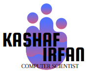

<!DOCTYPE html>
<html lang="en">
<head>
<meta charset="UTF-8">
<meta name="viewport" content="width=device-width, initial-scale=1.0">
<title>Portfolio</title>

</head>
<body>

<nav class="navbar">
  <a href="#" class="navbar-brand">
    Kashaf Irfan 
  </a>
  

    <a href="#about">About</a>
    <a href="#projects">Projects</a>
    <a href="#contact">Contact</a>
  

</nav>

  

    <h1>I'm Kashaf Irfan</h1>
    
I,a computer scientist, is a scholar who specializes in the academic study of computer science.
     I typically work on the theoretical side of computation. Although I can also focus my work and research on specific
     areas (such as algorithm and data structure development and design, software engineering, information theory,
      database theory, theoretical computer science, numerical analysis, programming language theory, compiler,
       computer graphics, computer vision, robotics, computer architecture, operating system), their foundation 
       is the theoretical study of computing from which these other fields derive. 

  

  

    
  

    <h1>My Projects</h1>
    

      
An Event Management System

      
Utilizing relational database principles, our system ensures 
        streamlined data storage, retrieval, and manipulation, enhancing the efficiency and effectiveness 
        of event management processes.

    

    

      
Potion Explosion Game

      
Implementing efficient memory allocation and 
        process synchronization, our project enhances the gaming experience by minimizing latency and maximizing
         system performance.

    

    

        
Text-Editor

        
Implementing advanced data structures like linked lists and trees, our 
            project ensures fast and reliable text processing, enabling seamless editing experiences.

      

  

  

    <a href="">@kashaf</a>
    <a href="">abc_xyz</a>
    Phone: +11111111111

  Designed by Kashaf Irfan

</body>
</html>
